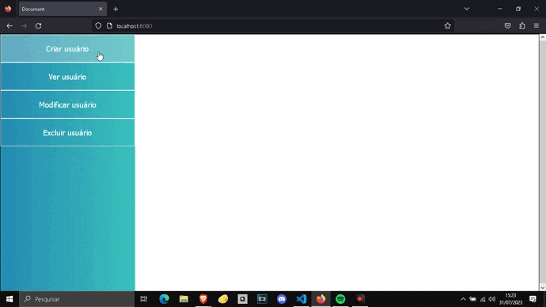
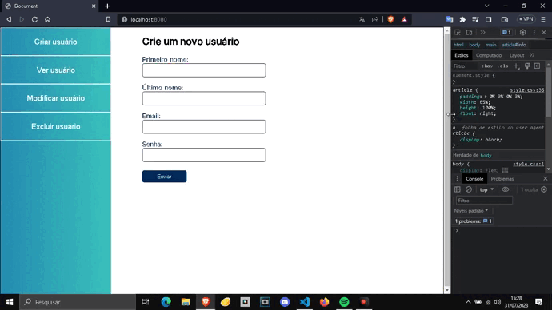

<h1 align="center"> A CRUD system made in Node.js and mongoDB </h1>

this project consists of a crud system with front-end, back-end and database interaction for registering and maintaining user data 

  <a href="#🚀-technologies">Technologies</a>&nbsp;&nbsp;&nbsp;|&nbsp;&nbsp;&nbsp;
  <a href="#💻-project">Project</a>

 

  

## 🚀 Technologies

This project was developed with the following technologies:

- NODE.js
- MongoDB
- Modules Express, mongoose and EJS
- Javascript, Html, Css

## 💻 Project

In this server there are the main necessary functionalities, such as adding, deleting, viewing and modifying users using mainly the 'Express' library and 'Ejs' for interactive system.

The server and the interactive system only stores information if they are in accordance with the pre-established scope and does all data processing in JSON and send to mongoDB database.

the page was made for different types of devices, being fully <strong>responsive</strong> and <strong>adaptive</strong>

- Access the finished project online: https://github.com/Carlos-EduardoAlmeida/CRUDinNode.js

---

Made by Carlos Eduardo De Almeida Silva